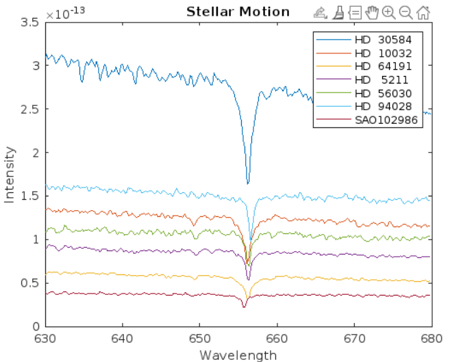

# 🌌 Stellar Motion — Doppler Effect Analysis in MATLAB

This project visualizes and analyzes the motion of stars by examining their light spectra using MATLAB. It demonstrates how the **Doppler Effect** causes shifts in the hydrogen absorption line in a star's spectrum — allowing us to estimate the **star's velocity relative to Earth**.

---

## 📖 Overview

Stars emit light that can be captured and broken down into a spectrum — a plot of **intensity vs. wavelength**.  
Hydrogen, a major component of most stars, absorbs light at **656.3 nm**, creating a noticeable dip in the spectrum.

If a star is moving:
- **Away from Earth** → the absorption dip shifts **toward longer wavelengths** (redshift).
- **Toward Earth** → the dip shifts **toward shorter wavelengths** (blueshift).

By analyzing this shift, we can calculate the **speed and direction** of the star's motion.

---

## 🔬 What This Project Does

- Loads spectral intensity data from multiple stars.
- Constructs a wavelength scale based on measurement parameters.
- Plots the spectrum of a selected star.
- Identifies the wavelength of the hydrogen absorption dip.
- Calculates the **velocity of the star** using the Doppler shift formula.

---

## ⚙️ Tools Used

- **Language**: MATLAB
- **Environment**: MATLAB Live Script (.mlx) or MATLAB Online
- **Core Concepts**:
  - Doppler Effect
  - Spectral Analysis
  - Data Visualization

---

## 📈 Sample Plot

  
*Figure: Spectrum of a star showing absorption dip near 656.3 nm*

---

## 🧮 Key Equations

**Wavelength scale**:
```matlab
lambda = lambdaStart : lambdaDelta : lambdaEnd;
